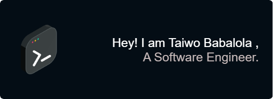

### Hi there! I am Taiwo 👋

I am a software engineer from Lagos, Nigeria. I am passionate about using my knowledge
to make quality education accesible to as many young people as possible.

- 🌱 I’m currently a software engineering student at ALX AFRICA
- 💬 Ask me about C, Python, terminal commands on Ubuntu or any linux distribution. I promise
   to respond as try to help.
- 📫 How to reach me: ()[https://twitter.com/realtaiwo_peter] ()[www.linkedin.com/in/taiwo-babalola-peter]

- ⚡ Fun fact: 
	- I use Vim and enjoy it 😁. 
	- I appear occasionally on the Hinted Neuron podcast.
	- I use  and 

### Familiar with:
       

<!--
**Taiwopeter-babs/Taiwopeter-babs** is a ✨ _special_ ✨ repository because its `README.md` (this file) appears on your GitHub profile.

Here are some ideas to get you started:

- 🔭 I’m currently working on ...
- 🌱 I’m currently learning ...
- 👯 I’m looking to collaborate on ...
- 🤔 I’m looking for help with ...
- 💬 Ask me about ...
- 📫 How to reach me: ...
- 😄 Pronouns: ...
- ⚡ Fun fact: ...
-->
