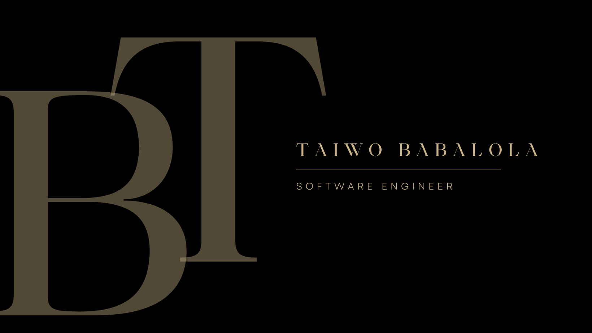

### Hi there! I am Taiwo 👋

I am a software engineer who is passionate about using my knowledge
to make quality education accesible to as many young people as possible.

- 🌱 I’m currently a software engineering student at ALX AFRICA learning how how build solutuions for growth and development. I put the knowledge of relevant tools to use, as well as learning new languages and industry best practices.
- 👯 I’m looking to partner and contribute to both existing and novel projects.
- 📫 How to reach me: [Twitter](https://twitter.com/realtaiwo_peter) [LinkedIn](https://linkedin.com/in/taiwo-babalola-peter)

- ⚡ Fun fact: 
	- I use Vim and enjoy it 😁. 
	- I appear occasionally on the Hinted Neuron podcast.

### Languages:
       
